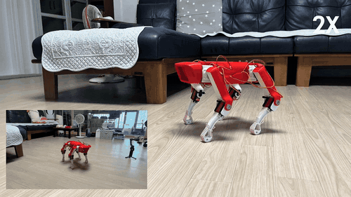

# SpotMicro 오픈소스 4족보행 로봇의 실측 기반 보행 제어와 강화학습

> **팀 KINETIQ** · 2026 오픈소스 개발자대회 출품작 (일반부문 · 자유과제)

100만원대 오픈소스 하드웨어로 만든 4족보행 로봇을 **실제로 걷게 만들고**, 그 과정에서
발견한 기존 오픈소스 모델의 치수 오류를 실측으로 바로잡아 공개합니다.
전 스택이 OSI 인증 오픈소스이며, 학습·평가·배포 어느 단계에서도 **GPU 를 요구하지
않습니다.**



*실측으로 기구학을 정정한 뒤의 보행. 좌하단은 전경, 우하단은 폰 조작 UI. 2배속.*

---

## 무엇을 발견했나

공개된 SpotMicro 코드를 그대로 따라가도 로봇이 제대로 걷지 않습니다.
원인은 소프트웨어가 아니라 **모델이 실물과 달랐던 것**이었습니다.

| 기구 파라미터 | 공개 코드 | 실측 | 오차 |
|---|---:|---:|---:|
| 대퇴 `l3` | 100 | **125** | +25% |
| 하퇴 `l4` | 100 | **138** | +38% |
| **다리 전체** | 200 | **263** | **+31%** |
| 앞뒤 어깨축 `L` | 140 | **185** | +32% |

역기구학이 계산한 발끝 위치 자체가 틀려 있었으므로, 그 위에서 찾은 보행 파라미터는
전부 오차를 우회하는 보정이었습니다. 치수를 바로잡자 **좌우 트림 보정 0 으로
전진**했습니다.

같은 SpotMicro 를 만드는 누구에게나 그대로 적용되는 결과입니다.

---

## 빠른 시작

```bash
git clone --depth 1 https://github.com/robertchoi/oss_spotmicro.git
cd oss_spotmicro && uv sync          # Python 3.12, GPU 불필요
```

```bash
# 로봇 모델 검증 — 시뮬레이터와 실물 제어 코드가 같은 기하를 쓰는지
uv run python rl/validate_mjcf.py

# 강화학습                                        (진행 중)
uv run python -m rl.train --timesteps 20000000
uv run python -m rl.eval --run runs/walk --render

# 실물 보행 (Raspberry Pi CM4 에서)
python JetsonNano/start_automatic_gait.py
```

조작은 키보드 또는 **폰 웹 브라우저**(`http://<로봇IP>:8080`)로 합니다.
보폭·몸통높이·보행주기·다리별 트림을 로봇을 보면서 실시간으로 조정하고, 네 발 지지
비율과 무릎 요구 각속도가 함께 표시되어 서보 정격을 넘으면 경고합니다.

---

## 저장소 구조

이 저장소는 오픈소스 프로젝트를 상속받았습니다.
**`[신규]` 는 본 팀이 만든 것, `[상속]` 은 upstream 에서 받은 것입니다.**

```
oss_spotmicro/
├── rl/                     강화학습 — 모델 생성부터 학습까지         [신규]
│   ├── gen_mjcf.py           실측 기구 상수 -> MuJoCo 모델 생성
│   ├── validate_mjcf.py      검증 게이트 (순기구학 대조 등 8종)
│   ├── model_api.py          학습이 참조하는 단일 인터페이스
│   ├── render_gait.py        보행 렌더링
│   └── mjcf/                 생성된 로봇 모델
├── Common/                 로봇 런타임                                [신규]
│   ├── servo_map.py          서보 오프셋·부호 (단일 출처)
│   ├── gait_params.py        보행 파라미터
│   └── web_control.py        폰 웹 조작 UI
├── Kinematics/             역기구학 — 실측 링크 길이로 정정     [상속+수정]
├── JetsonNano/             서보 제어 · PCA9685                  [상속+수정]
│                             디렉터리명은 upstream 유래.
│                             현재 대상 보드는 Raspberry Pi CM4
├── study/                  개발 일지 — 3인 11주                       [신규]
├── docs/                   하드웨어 문서 · 배선도 · 데모 미디어        [신규]
├── checkpoints/            학습된 정책 가중치                          [신규]
├── Simulation/             PyBullet — 초기 검증용                      [상속]
├── urdf/                   초기 URDF (학습에는 rl/mjcf/ 사용)          [상속]
├── STL/ STEP_Files/ Parts/ 3D 기구 설계 — CC BY 3.0                    [상속]
│   └── STL/kinetiq/          본 팀 설계 파트 (거치대·마운팅 플레이트)  [신규]
├── Images/                 upstream 데모 — Road-Balance 팀 로봇        [상속]
├── LICENSE                 GPL-3.0
└── NOTICE                  출처·라이선스 상세
```

> **`Images/` 의 GIF 는 본 팀 로봇이 아닙니다.** upstream 데모이며, 본 팀이
> 촬영한 미디어는 `docs/media/` 에 있습니다.
>
> **소프트웨어와 3D 모델의 라이선스가 다릅니다** — 코드는 GPL-3.0, 기구 설계는
> CC BY 3.0. 상세는 [`NOTICE`](NOTICE) 4장.

---

## 개발 일지

11주간의 기록을 실패 과정과 함께 공개합니다. 전원 설계가 왜 실패했는지, 제어보드가
고장나 어떻게 전환했는지, 배선을 어떻게 바꿔 왔는지가 그대로 남아 있습니다.

| 담당 | 경로 | 주요 내용 |
|---|---|---|
| minho | [`study/minho/`](study/minho/) work01~11 | 서보 선정, 조립, 전원 재설계, PCA9685 핀맵, **실측 기반 기구학 정정**, CM4 전환 |
| iru-han | [`study/iru-han/`](study/iru-han/) week01~12 | 기구학, 트로팅 보행, **물리엔진 벤치마크**, MuJoCo 환경 |
| robert | [`study/robert/`](study/robert/) week01~10 | 기구학·보행 실습, **MuJoCo/SB3 학습 파이프라인**, uv 프로젝트 구성 |

---

## 설계상의 핵심 판단

**행동은 토크가 아니라 관절 각도입니다.** 실물은 PCA9685 가 구동하는 위치제어
서보라 토크 명령을 받을 수 없습니다. 정책이 기본 자세로부터의 각도 변위를 출력하므로
학습한 결과를 별도 변환 없이 실물 제어 루프에 넣을 수 있습니다.

**시뮬레이션 모델을 URDF 에서 변환하지 않고 실측 상수에서 직접 생성합니다.**
역기구학과 시뮬레이터가 같은 상수를 import 하므로 한쪽만 고쳐 어긋나는 일이
구조적으로 불가능합니다. 순기구학 대조로 **오차 0.0000 mm** 를 확인했습니다.

---

## 라이선스

**GPL-3.0-or-later.** 본 저장소는 GPL-3.0 저작물의 파생 저작물이므로 팀이 새로
작성한 코드를 포함해 전체가 동일 라이선스로 배포됩니다.

3D 모델(`STL/`, `STEP_Files/`, `Parts/`)은 원저작자 KDY0523 의 **CC BY 3.0** 을
따릅니다 — [`STL/LICENSE.txt`](STL/LICENSE.txt).

상세 출처와 제3자 라이선스 목록은 [`NOTICE`](NOTICE) 를 참조하세요.
upstream 원본 README 는 [`docs/UPSTREAM_README.md`](docs/UPSTREAM_README.md) 에
보존되어 있습니다.

---

## English

**Measurement-grounded locomotion and reinforcement learning for the low-cost SpotMicro quadruped.**

The published SpotMicro kinematic model disagreed with the assembled robot — the legs
were 31% longer than the code assumed — so the inverse kinematics computed the wrong
foot positions and every gait parameter tuned on top of it was compensating for that
error. Measuring the machine and correcting the model produced a robot that walks with
zero lateral trim.

On that corrected model, a walking policy is trained in **MuJoCo** and targets a
**Raspberry Pi Compute Module 4** driving twelve hobby position servos over two PCA9685
boards. Actions are joint angle offsets rather than torques, because the hardware cannot
accept torque commands. Every component of the stack is OSI-approved open source and the
whole pipeline runs **without a GPU**.

Built on [SpotMicroAI](https://github.com/FlorianWilk/SpotMicroAI) (GPL-3.0) and the
[SpotMicro 3D design](https://www.thingiverse.com/thing:3445283) by KDY0523 (CC BY 3.0).
See [`NOTICE`](NOTICE) for full attribution.
