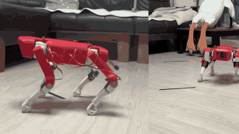

# SpotMicro 오픈소스 4족보행 로봇의 실측 기반 보행 제어와 강화학습

> **팀 KINETIQ** · 2026 오픈소스 개발자대회 출품작 (일반부문 · 자유과제)

**부품비 46만원**의 오픈소스 하드웨어로 만든 4족보행 로봇을 **실제로 걷게 만들고**, 그 과정에서
발견한 기존 오픈소스 모델의 치수 오류를 실측으로 바로잡아 공개합니다.
전 스택이 OSI 인증 오픈소스이며, 학습·평가·배포 어느 단계에서도 **GPU 를 요구하지
않습니다.**



*실측으로 기구학을 정정한 뒤의 보행. 왼쪽은 측면, 오른쪽은 정면.
보폭 −80 mm · 몸통 높이 90 mm · 주기 1300 ms · 듀티 0.32 · 좌우 트림 0.*

---

## 무엇을 발견했나

공개된 SpotMicro 코드를 그대로 따라가도 로봇이 제대로 걷지 않습니다.
원인은 **한 저장소 안에 서로 다른 로봇이 세 벌 있었다는 것**이었습니다.

`Simulation/` 은 한 프로세스에서 이 세 가지를 동시에 쓰고 있었습니다.

| 무엇이 | L | W | 대퇴 | 하퇴 |
|---|---:|---:|---:|---:|
| PyBullet 이 화면에 띄운 로봇 (URDF) | 186 | 72 | 120.4 | 135 |
| 발끝 목표 좌표를 만드는 코드 | 140 | **120** | — | — |
| 관절 각도를 계산하는 역기구학 | 140 | 75 | **100** | **100** |

**시뮬레이터 안에 로봇이 둘이었습니다.** PyBullet 이 화면에 띄우고 중력과 충돌을
계산하는 몸은 다리가 120.4+135mm 인데, 그 몸에 넣을 관절 각도를 계산하는 코드는
100+100mm 로 알고 있습니다. 같은 각도를
넣어도 발이 의도한 자리에 가지 않고, 보행 구간 95개 자세에서 중앙값 18mm, 최대 33mm
어긋납니다 (`python tools/ik_urdf_mismatch.py` 로 재현). 발끝 위치가 애초에 틀렸으므로
그 위에서 조정한 보행 파라미터는 보행을 좋게 만든 것이 아니라 그 오차를 우회하는
보정이었습니다.

`l3=l4=100` 이라는 값의 출처도 확인했습니다. upstream(FlorianWilk)은 `120/155` 였고,
이 값은 2020-10-03 커밋 `d2c3883` 에서 바뀐 것입니다 — 커밋 메시지는
*"Folder ordered, Useless Images deleted, keyborad controller done"* 으로, 기구 치수를
바꾼 의도가 기록되어 있지 않습니다.

### 그래서 어긋날 수 없는 구조로 바꿨습니다

치수를 실측해 한 곳에 모으고, **시뮬레이션 모델을 그 상수에서 생성**합니다.
URDF 를 변환하는 것이 아니라 숫자에서 만들어내므로, 역기구학과 시뮬레이터가
같은 상수를 import 합니다. 한쪽만 고쳐 어긋나는 일이 구조적으로 불가능합니다.

```
Kinematics/kinematics.py   실측 기구 상수 (단일 출처)
        │
        ├──→ 역기구학 (실물 제어)
        └──→ rl/gen_mjcf.py ──→ rl/mjcf/spotmicro.xml (시뮬레이션)
                                         │
                             rl/validate_mjcf.py 가 8개 게이트로 검증
```

치수를 바로잡고 지지 다각형을 무게중심에 맞추자 **좌우 트림 보정 없이 전진**했습니다.

접지 문제도 부품비 없이 해결했습니다. 초기에는 종이박스와 카펫 양쪽에서 발이
미끄러졌으나, 발바닥에 3 mm 미끄럼 방지 패드를 붙이자 **실측 이동 거리가 이론값의
100%** 가 되었습니다. 시뮬레이션 모델도 발 구체의 마찰계수 0.9 로 이를 반영합니다.

---

## 빠른 시작

```bash
git clone --depth 1 https://github.com/robertchoi/oss_spotmicro.git
cd oss_spotmicro && uv sync          # Python 3.12, GPU 불필요
```

### 로봇 없이 여기까지 됩니다

로봇도 GPU 도 없이 실행됩니다. **이 저장소의 검증 가능한 주장은 전부 여기서 확인됩니다.**

```bash
make verify     # 모델-실물 일치 8단계 검증. 기하 일치는 0.0000mm 를 요구합니다
make eval       # 학습된 정책을 재생하고, 실물 서보가 낼 수 있는 명령인지 판정합니다
make eval-render   # 같은 것을 화면으로
make gait       # 규칙 기반 보행을 영상으로 저장
```

<details><summary><code>make</code> 없이 직접 실행하려면</summary>

```bash
uv run python rl/gen_mjcf.py        # 실측 상수 -> 시뮬레이션 모델 (생성물입니다)
uv run python rl/validate_mjcf.py   # 8단계 검증
uv run python -m rl.eval --run checkpoints --command 0.2 0 0
```

</details>

### 로봇이 있어야 하는 것

```bash
python RaspberryPi/start_automatic_gait.py    # Raspberry Pi 4B 에서
```

부품이 저희와 다르다면 **버그가 아니라 정상적인 포크입니다.** 자기 치수를
`Kinematics/kinematics.py` 한 곳에 넣고 `make verify` 를 돌리면, 시뮬레이션 모델과
실물 제어가 함께 따라옵니다. 재는 법과 함정은 [CONTRIBUTING.md](CONTRIBUTING.md) 에
있습니다.

조작은 키보드 또는 **폰 웹 브라우저**(`http://<로봇IP>:8080`)로 합니다.
보폭·몸통높이·보행주기·다리별 트림을 로봇을 보면서 실시간으로 조정하고, 네 발 지지
비율과 무릎 요구 각속도가 함께 표시되어 서보 정격을 넘으면 경고합니다.

---

## 저장소 구조

이 저장소는 오픈소스 프로젝트를 상속받았습니다.
**`[신규]` 는 본 팀이 만든 것, `[상속]` 은 upstream 에서 받은 것입니다.**

```
oss_spotmicro/
├── rl/                     강화학습 — 모델 생성부터 학습까지         [신규]
│   ├── gen_mjcf.py           실측 기구 상수 -> MuJoCo 모델 생성
│   ├── validate_mjcf.py      검증 게이트 (순기구학 대조 등 8종)
│   ├── model_api.py          학습이 참조하는 단일 인터페이스
│   ├── render_gait.py        보행 렌더링
│   └── mjcf/                 생성된 로봇 모델
├── Common/                 로봇 런타임                                [신규]
│   ├── servo_map.py          서보 오프셋·부호 (단일 출처)
│   ├── gait_params.py        보행 파라미터
│   └── web_control.py        폰 웹 조작 UI
├── Kinematics/             역기구학 — 실측 링크 길이로 정정     [상속+수정]
├── RaspberryPi/            서보 제어 · PCA9685 · 캘리브레이션    [상속+수정]
│                             디렉터리명은 upstream 유래.
│                             현재 대상 보드는 Raspberry Pi 4B
├── study/                  개발 일지 — 3인 11주                       [신규]
├── docs/                   하드웨어 문서 · 배선도 · 데모 미디어        [신규]
├── checkpoints/            학습된 정책 가중치                          [신규]
├── Simulation/             PyBullet — 초기 검증용                      [상속]
├── urdf/                   초기 URDF (학습에는 rl/mjcf/ 사용)          [상속]
├── STL/                    3D 기구 설계 — CC BY 3.0                    [상속]
│   ├── files/                KDY 원본 판  ← 본 팀이 출력한 것
│   ├── lidar/                라이다 마운트 (본 팀 미사용)
│   ├── kinetiq/              본 팀 설계 파트 (거치대·마운팅 플레이트)  [신규]
│   └── *.stl                 배터리·LED 홀더 등 액세서리
├── Parts/                  3D 기구 설계 — Jetson Nano 판               [상속]
│                             urdf/ 가 이쪽을 참조합니다. 본 팀은 안 씁니다
├── STEP_Files/             위 파트의 CAD 원본                          [상속]
├── Images/                 upstream 데모 — Road-Balance 팀 로봇        [상속]
├── LICENSE                 GPL-3.0
└── NOTICE                  출처·라이선스 상세
```

> **3D 파트가 두 벌입니다. 무엇을 출력할지 헷갈리는 지점입니다.**
>
> | | `Parts/` | `STL/files/` |
> |---|---|---|
> | 구성 | Jetson Nano 판 | KDY0523 원본 판 |
> | `urdf/` 가 보는 곳 | **여기** | — |
> | 본 팀이 출력한 것 | — | **여기** |
> | 몸통 | 통짜 (`mainbody` 240mm) | 판 조립 (끝판 + 측면판 + 커버 4장) |
>
> 다리는 대응하는 부품이 있으나 이름이 다릅니다. `Parts/larm` = `STL/files/L_arm`,
> `Parts/lfoot` = `STL/files/L_wrist` 이며 둘 다 길이가 같습니다. **`Parts/lfoot`
> 은 발이 아니라 하퇴 전체입니다.** 본 팀은 Raspberry Pi 4B 를 쓰므로 KDY 판을
> 출력했고, `STL/files/foot.stl` 은 TPU 가 필요해 출력하지 않고 미끄럼 방지 패드
> 3mm 로 대신했습니다. 실측 `l4=135` 가 그 값입니다.
>
> **`Images/` 의 GIF 는 본 팀 로봇이 아닙니다.** upstream 데모이며, 본 팀이
> 촬영한 미디어는 `docs/media/` 에 있습니다.
>
> **소프트웨어와 3D 모델의 라이선스가 다릅니다** — 코드는 GPL-3.0, 기구 설계는
> CC BY 3.0. 상세는 [`NOTICE`](NOTICE) 4장.

---

## 개발 일지

11주간의 기록을 실패 과정과 함께 공개합니다. 전원 설계가 왜 실패했는지, 제어보드가
고장나 어떻게 전환했는지, 배선을 어떻게 바꿔 왔는지가 그대로 남아 있습니다.

| 담당 | 경로 | 주요 내용 |
|---|---|---|
| minho | [`study/minho/`](study/minho/) work01~11 | 서보 선정, 조립, 전원 재설계, PCA9685 핀맵, **실측 기반 기구학 정정**, 4B 전환 |
| iru-han | [`study/iru-han/`](study/iru-han/) week01~12 | 기구학, 트로팅 보행, **물리엔진 벤치마크**, MuJoCo 환경 |
| robert | [`study/robert/`](study/robert/) week01~10 | 기구학·보행 실습, **MuJoCo/SB3 학습 파이프라인**, uv 프로젝트 구성 |

---

## 설계상의 핵심 판단

**행동은 토크가 아니라 관절 각도입니다.** 실물은 PCA9685 가 구동하는 위치제어
서보라 토크 명령을 받을 수 없습니다. 정책이 기본 자세로부터의 각도 변위를 출력하므로
학습한 결과를 별도 변환 없이 실물 제어 루프에 넣을 수 있습니다.

**시뮬레이션 모델을 URDF 에서 변환하지 않고 실측 상수에서 직접 생성합니다.**
역기구학과 시뮬레이터가 같은 상수를 import 하므로 한쪽만 고쳐 어긋나는 일이
구조적으로 불가능합니다. 순기구학 대조로 **오차 0.0000 mm** 를 확인했습니다.

---

## 라이선스

**GPL-3.0-or-later.** 본 저장소는 GPL-3.0 저작물의 파생 저작물이므로 팀이 새로
작성한 코드를 포함해 전체가 동일 라이선스로 배포됩니다.

3D 모델(`STL/`, `STEP_Files/`, `Parts/`)은 원저작자 KDY0523 의 **CC BY 3.0** 을
따릅니다 — [`STL/LICENSE.txt`](STL/LICENSE.txt).

상세 출처와 제3자 라이선스 목록은 [`NOTICE`](NOTICE) 를 참조하세요.
upstream 원본 README 는 [`docs/UPSTREAM_README.md`](docs/UPSTREAM_README.md) 에
보존되어 있습니다.

---

## English

**Measurement-grounded locomotion and reinforcement learning for the low-cost SpotMicro quadruped.**

This repository contained three different robots at once. PyBullet loaded a URDF with a
186 mm body and 120/135 mm leg links, the code that produced foot targets assumed 140 and
120, and the inverse kinematics solving for joint angles used 140/75 with 100/100 links.
The simulator was showing one robot while being commanded by the kinematics of another,
so the computed foot positions were wrong before any tuning began - and every gait
parameter found on top of that was compensating for the discrepancy rather than improving
the gait.

The fix was structural rather than a corrected constant. Measured dimensions now live in
one module, and the simulation model is **generated from them** instead of converted from
URDF, so the inverse kinematics and the simulator import the same numbers and cannot drift
apart. Eight gates check the generated model before any training runs; the strictest
compares forward kinematics between the two and requires agreement to 0.0000 mm.

On that corrected model, a walking policy is trained in **MuJoCo** and targets a
**Raspberry Pi 4B** driving twelve hobby position servos over two PCA9685
boards. Actions are joint angle offsets rather than torques, because the hardware cannot
accept torque commands. Every component of the stack is OSI-approved open source and the
whole pipeline runs **without a GPU**.

Built on [SpotMicroAI](https://github.com/FlorianWilk/SpotMicroAI) (GPL-3.0) and the
[SpotMicro 3D design](https://www.thingiverse.com/thing:3445283) by KDY0523 (CC BY 3.0).
See [`NOTICE`](NOTICE) for full attribution.
